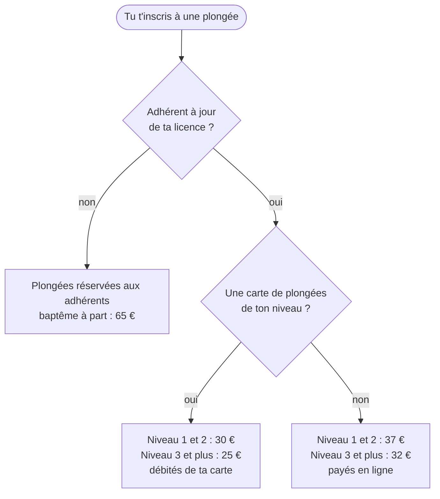

## Réponse adhérent

Les plongées à la carte sont réservées aux adhérents à jour de leur licence. Le baptême est à part : 65 €, sans adhésion ni licence.

Le prix d'une plongée dépend de ton niveau et de ta carte de plongées :

| Ton cas | Prix d'une plongée | Comment elle est réglée |
|---|---|---|
| Niveau 1 et 2, sans carte | 37 € | en ligne, à l'inscription |
| Niveau 3 et plus, sans carte | 32 € | en ligne, à l'inscription |
| Niveau 1 et 2, avec une carte de ton niveau | 30 € | débitée de ta carte |
| Niveau 3 et plus, avec une carte de ton niveau | 25 € | débitée de ta carte |

Une carte crédite un montant sur ton compte VPDive, et chaque plongée en retire son prix :

| Carte | Prix | Montant crédité | Soit par plongée |
|---|---|---|---|
| 5 plongées, niveau 1 et 2 | 165 € | 150 € | 33 € |
| 10 plongées, niveau 1 et 2 | 300 € | 300 € | 30 € |
| 5 plongées, niveau 3 et plus | 135 € | 125 € | 27 € |
| 10 plongées, niveau 3 et plus | 250 € | 250 € | 25 € |

La carte de 5 coûte un peu plus que ce qu'elle crédite : c'est l'écart de prix avec la carte de 10.

Dans VPDive, ce qu'il reste sur ta carte s'affiche en négatif sous « reste à payer ». Ce n'est pas une dette mais ton avoir, comme l'explique la fiche « Mon carnet affiche un montant négatif en « reste à payer » ».

## Procédure résolveur

1. Dans VPDive, chaque activité porte deux produits : « Plongée unitaire N1 et N2 », à 50 € par défaut, et « Plongée unitaire N3 et + », à 45 € par défaut. Ces prix concernent les non-adhérents, que le club refuse.
2. Pour un adhérent, des plans tarifaires remplacent ce prix. « Plongée sans carnet » : 35 € en niveau 1 et 2, 32 € en niveau 3 et plus. « Avec carnet » et « avec carnet 5 plongées », pour qui a acheté la Carte 10 ou la Carte 5 de son niveau : 30 € en niveau 1 et 2, 25 € en niveau 3 et plus.
3. VPDive débite le montant du plan, en argent ou sur la carte.

Anomalies à repérer :

- un montant débité hors de la grille, par exemple 2 €, ou 50 € sur une carte ;
- le plan « Plongée sans carnet » débite 35 € en niveau 1 et 2 alors que la page Tarifs annonce 37 € : écart connu, à corriger dans VPDive ;
- la condition « a acheté la carte » reste vraie quand la carte est vide ou date d'une saison passée, donc l'adhérent garde le tarif carnet. C'est un trou de configuration, à signaler au trésorier.

Pour vérifier et corriger :

1. Pour savoir sur quelle carte une plongée a été débitée : le bloc « Cartes VPDive » de la demande liste chaque carte avec chaque débit (sortie, date, montant, qui, quand). Pour vérifier un total partiel ou corriger, page Paiements de VPDive : filtrer sur l'adhérent, déplier le panier de la carte, survoler le « i » ; la date de la ligne est celle de l'inscription.
2. Pour corriger un débit : recréditer la carte du bon montant (une ligne négative) avec un commentaire qui dit pourquoi.
